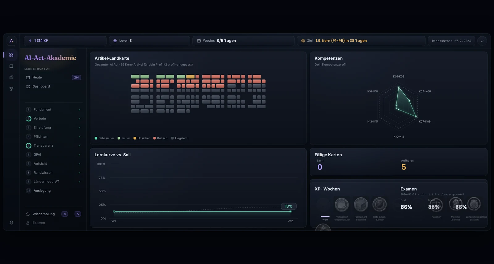
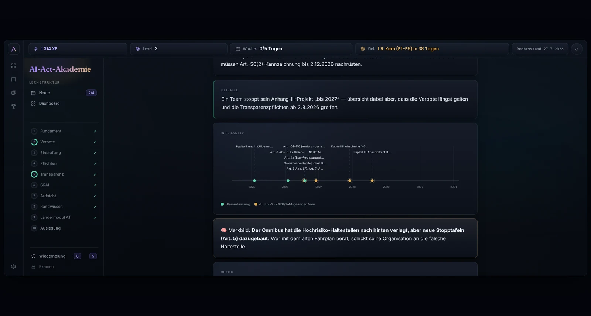

# AI-Academy

**Interaktives Lerntraining zum EU AI Act**
**Interactive training on the EU AI Act**

[](https://github.com/silentspike/ai-academy/actions/workflows/ci.yml)
[](https://github.com/silentspike/ai-academy/actions/workflows/codeql.yml)
[](LICENSE)
[](LICENSE-CONTENT)
[](#aufbau)
[](docs/INTENDED-PURPOSE.md)

---

> **Hinweis:** Die AI-Academy ersetzt keine Rechtsberatung. Die Inhalte beruhen auf
> einer redaktionellen Arbeitskonsolidierung der Amtsblatttexte und dienen der
> persönlichen Weiterbildung. Wie geprüft wurde und wo die Grenzen liegen, steht in
> [docs/REVIEW-PROCESS.md](docs/REVIEW-PROCESS.md).

---

> **For international reviewers:** AI-Academy is an interactive training tool for
> the EU AI Act (Regulation (EU) 2024/1689 as amended by Regulation (EU) 2026/1744,
> legal baseline 27 July 2026). It runs entirely on the user's machine — no hosted
> service, no account, no telemetry — and connects to the user's own frontier model
> subscription through the vendor CLI. **The learning content is German**, because
> the subject matter is: the Official Journal text, Austrian enforcement, German
> legal terminology. Code, documentation and workflows are English.
> [Full English summary →](#english-summary)

---

Verordnung (EU) 2024/1689 in der Fassung der Verordnung (EU) 2026/1744
(„Digital Omnibus"), Zielrechtsstand 27.7.2026. Mit eingebettetem Tutor,
verteilter Wiederholung, Kompetenzmodell, Fachgesprächen gegen einen simulierten
Gesprächspartner und einem Prüfungssystem aus geprüftem Fragenbestand.



> **Wofür es bestimmt ist:** persönliche, freiwillige, nicht formale Weiterbildung.
> **Wofür nicht:** Personalentscheidungen, Leistungsbeurteilungen, formale
> Abschlüsse, akkreditierte Zertifizierungen. Ergebnisse sind ein persönlicher,
> unbeaufsichtigter Lernnachweis — kein Zeugnis.
> Einzelheiten in [docs/INTENDED-PURPOSE.md](docs/INTENDED-PURPOSE.md).

## Warum es das gibt

Der Verordnungstext umfasst mehr als 140 Amtsblattseiten und verweist massiv auf
sich selbst. Ihn zu lesen erzeugt keine anwendbare Kompetenz — gebraucht wird die
Fähigkeit, einen konkreten Fall einzustufen, die Einstufung zu begründen und
Einwände zu parieren. Genau darauf ist das Training ausgelegt: Aufgabe zuerst,
Erklärung danach, jede Aussage mit Fundstelle, und Prüfungen, die eine Aussage
verlangen statt Wiedererkennen.

Erschwerend kommt hinzu, dass sich der Rechtsstand am 24.7.2026 verschoben hat.
Wer weiterhin die alten Fristen lernt, gibt im Beruf falsche Auskunft. Das
Training ist durchgehend auf dem geänderten Stand gebaut, und die Änderung selbst
ist Lernstoff.

## Voraussetzungen

- **Node.js ab Version 20** — die einzige Laufzeit. Die Bridge kommt ohne
  Abhängigkeiten aus.
- **Ein Abo bei einem Spitzenmodell**: Claude (Pro oder Max, über die
  `claude`-Anwendung) oder ChatGPT (über die `codex`-Anwendung). Der Zugang läuft
  ausschließlich über die Anmeldung dieser Anwendungen. **Schlüssel für
  Programmierschnittstellen werden bewusst nicht unterstützt**, andere
  Modellklassen ebenfalls nicht — die Selbstprüfung sperrt Prüfungen sonst.
- **Browser**: Chrome, Firefox, Edge oder Safari auf dem Desktop.

## Loslegen

```bash
git clone https://github.com/silentspike/ai-academy.git
cd ai-academy
node bridge/bridge.mjs                # liefert Anwendung und Schnittstelle gemeinsam aus
node bridge/bridge.mjs --no-llm       # nur ansehen, ohne Modellanbindung
node bridge/bridge.mjs --open         # dasselbe, öffnet zusätzlich den Browser
```

**Ohne Terminal:** Im Paket liegt für jedes System ein Startprogramm. Es prüft,
ob Node.js vorhanden und neu genug ist, startet die Bridge und öffnet den Browser
mit der fertigen Adresse — der Port wird zufällig vergeben und die Adresse trägt
das Kopplungsmerkmal, deshalb kann sie nicht fest hinterlegt werden.

| System | Datei | Aufruf |
|---|---|---|
| Linux | `start.sh` | im Dateimanager ausführen oder `./start.sh` |
| macOS | `start.command` | im Finder doppelklicken |
| Windows | `start.bat` | im Explorer doppelklicken |

Fehlt Node.js, sagt das Startprogramm es und nennt den Weg zur Installation,
statt kommentarlos ein Fenster zu schliessen.

Die Bridge nennt eine Adresse samt Kopplungsmerkmal. Im Browser öffnen,
Selbstprüfung abwarten, Einrichtung durchlaufen, loslernen.

**Mit einem Agenten einrichten:** Wer ohnehin mit einem Agenten arbeitet, gibt ihm
[SETUP-AGENT.md](SETUP-AGENT.md) — einen Einrichtungsauftrag mit maschinell
prüfbarer Abnahmeliste. Für Störungen gibt es
[TROUBLESHOOT-AGENT.md](TROUBLESHOOT-AGENT.md).

**Hinter einem eigenen Webserver:** Der Webbereich ist `public/`. Die Anwendung
ermittelt ihren Schnittstellenpfad dokumentrelativ, also `<basis>/api/` — dieser
Pfad muss an die Bridge weitergereicht werden. `data/` liegt strukturell außerhalb
des Webbereichs und darf nie erreichbar sein.

## Was enthalten ist

Zehn Phasen und ein Abschluss: Fundament, Verbote, Einstufung, Pflichten,
Transparenz, Universalmodelle, Aufsicht, Randwissen, Ländermodul Österreich,
Auslegung.

310 geprüfte Kernfragen, Fachgespräche mit vorgegebenem Sachverhalt, zweiteilige
Kapitelprüfungen (ohne und mit Verordnungstext), eine Abschlussprüfung aus
geschlossenem Teil und Fallarbeit, verteilte Wiederholung mit Behaltensstufen, ein
Kompetenzbild über achtzehn benannte Fähigkeiten und ein Erhaltungsbetrieb nach
bestandener Prüfung.



## Aufbau

| Verzeichnis | Inhalt |
|---|---|
| `public/` | Anwendungsgerüst — der einzige Webbereich |
| `app/` | Engine: Steuerung, Aufgaben, Widgets, Dialog, Wiederholung, Auswertung |
| `content/` | Lerninhalte als Daten; Schema in [content/SCHEMA.md](content/SCHEMA.md) |
| `bridge/` | Abhängigkeitsfreier Dienst: liefert die Anwendung aus, spricht mit dem Modell |
| `tutor/` | Erzeugung der Anweisungen; für Prüfungen ohne Notizen und Verlauf |
| `tools/` | Prüfwerkzeuge, Modultests, Paketbau |
| `docs/` | Zweckbestimmung, Bedrohungsmodell, Risiken, Herleitung der Bestehensgrenze |

Der Tutor ist **Erklärer und Bewerter auf Basis mitgelieferter Quellen — niemals
selbst Rechtsquelle**. Jede rechtliche Aussage trägt eine Fundstelle; unbelegte
Behauptungen des Modells werden unterdrückt oder sichtbar gekennzeichnet.

## Prüfen und Mitwirken

```bash
npm run test:unit      # Modultests
npm run test:content   # Schema, Fundstellen, Zahlen und Daten
npm run test:all
```

Einzelheiten in [TESTING.md](TESTING.md). Für Beiträge gilt
[CONTRIBUTING.md](CONTRIBUTING.md) — für Inhalte mit Rechtsbezug strenger als für
Code: Ohne Fundstelle kommt eine Aussage nicht durch die Schema-Prüfung.
Schwachstellen bitte nach [SECURITY.md](SECURITY.md), nicht über öffentliche
Meldungen.

## Rechtlicher Hinweis

Die Lerninhalte sind eine redaktionelle Arbeitskonsolidierung beider
Amtsblatttexte — keine amtliche konsolidierte Fassung und keine Rechtsberatung.
Jedes Inhaltsobjekt trägt Rechtsgrundlage und Status. Der Rechtsstand ändert sich;
der Ablauf dafür steht in [UPDATE-PROZESS.md](UPDATE-PROZESS.md).

## Lizenz

Programmcode unter [Apache-2.0](LICENSE), Lerninhalte und Bildmaterial unter
[CC BY 4.0](LICENSE-CONTENT). Zitate aus dem Amtsblatt der Europäischen Union sind
gemeinfrei und mit Quellenangabe frei verwendbar.

---

## English summary

**What it is.** An interactive training tool for the EU AI Act, built around the
legal baseline of 27 July 2026 — Regulation (EU) 2024/1689 as amended by
Regulation (EU) 2026/1744. Ten phases from fundamentals through prohibitions,
classification, obligations, transparency, general-purpose models, supervision and
national enforcement, ending in a two-part final exam.

**Why it exists.** Reading 140 pages of regulation does not produce applicable
competence. What is needed is the ability to classify a concrete system, justify
the classification with a citation, and defend it against objections. The training
is built for that: problem first, explanation second, every statement sourced, and
exams that require a defensible answer rather than recognition.

**How it runs.** Entirely on your machine. A dependency-free Node service serves
the application and talks to your own model subscription through the vendor CLI
(`claude` or `codex`). No hosted service, no account, no telemetry, no API keys —
sign-in happens in the CLI, and the pipeline rejects any reintroduction of key
handling. Learning state stays local and outside the served directory.

**How the content is governed.** Every content object carries a citation down to
the paragraph, the version it refers to, and a status. Schema validation rejects
unsourced legal statements. Exam questions pass a defined release path with two
separate review passes. The model is an explainer and grader on the basis of
supplied sources — never a legal source itself; unsupported claims are suppressed
or visibly flagged. The limits of this procedure, including the absence of an
independent legal release, are stated in
[docs/REVIEW-PROCESS.md](docs/REVIEW-PROCESS.md).

**What it is not for.** Personnel decisions, performance assessment, formal
qualifications or accredited certification. Results are a personal, unproctored
record of learning, not a certificate. See
[docs/INTENDED-PURPOSE.md](docs/INTENDED-PURPOSE.md).

**Language.** The learning content is German and will stay German — the source
material, the terminology and the national enforcement chapter are. Code,
comments, documentation, issues and commits are English.
